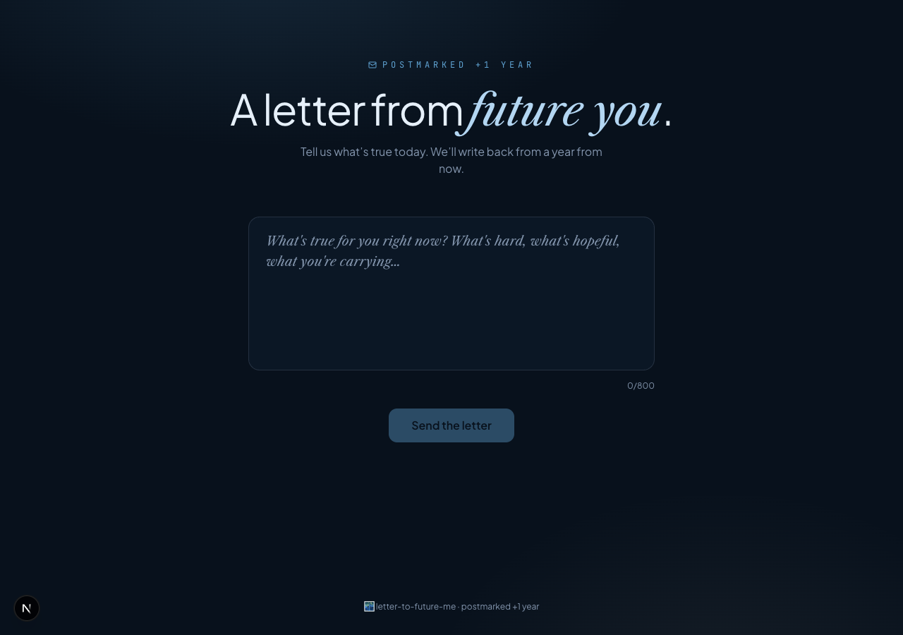

# 🌃 Letter to Future Me

> A letter from future you.

Tell us what&rsquo;s true today — what&rsquo;s hard, what&rsquo;s hopeful, what you&rsquo;re carrying. AI writes back a short, gentle letter dated one year from now. Downloadable as a postmarked envelope card on warm paper under a starry night.

## Stack

- Next.js 15 · App Router · TypeScript
- Tailwind CSS v4 (`@theme`)
- OpenAI `gpt-4o`
- `html-to-image`
- Framer Motion · lucide-react
- Libre Caslon Text · Plus Jakarta Sans · JetBrains Mono

## Setup

```bash
pnpm install
cp .env.example .env.local
# add your OPENAI_API_KEY
pnpm dev
```

Open http://localhost:3000.

## License

MIT


